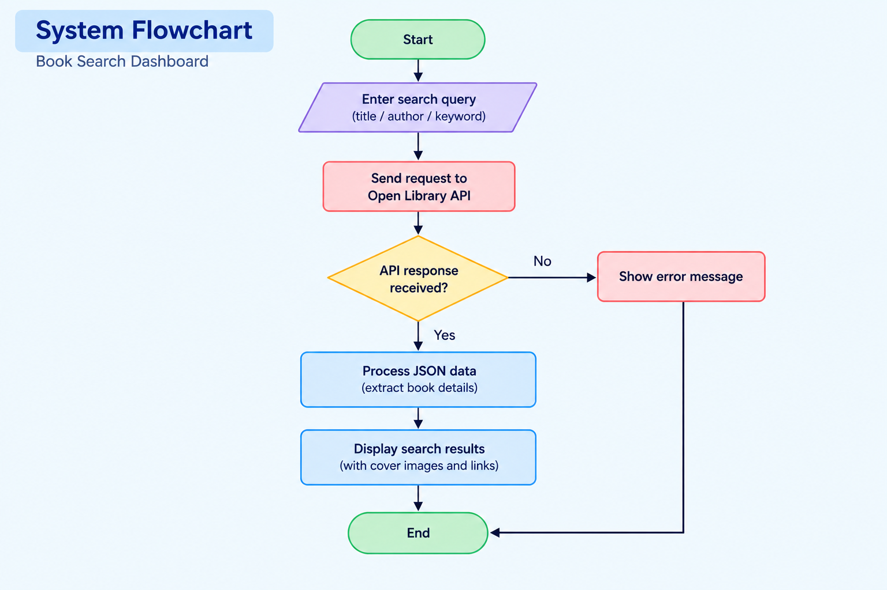
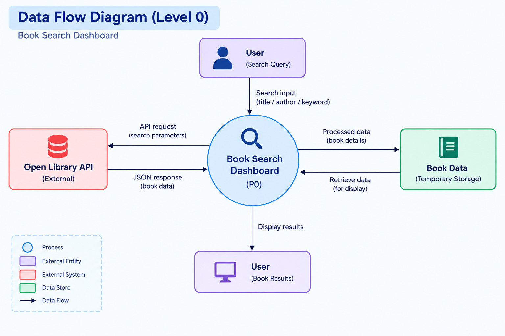

# 📚 Book Search Dashboard

## Introduction and Objective

The Book Search Dashboard is a Streamlit-based web application for searching books.
It uses the Open Library Search API to retrieve book information.
Users can search using a title, author name, or keyword.
The API response is received and processed in JSON format.
Required book details are displayed in an organized format.
Available book cover images and Open Library links are also provided.
The project demonstrates Python, Streamlit, API integration, and JSON processing.
It provides a simple and user-friendly platform to explore book information.

---
## 🛠️ Tools and Technologies Used

### Application Development

| **Technology** | **Purpose** |
|---|---|
| Python | Used as the core programming language for developing the application. |
| Streamlit | Used to create the interactive Book Search Dashboard. |
| Open Library Search API | Used to retrieve book information based on user search queries. |
| JSON | Used to process and handle the data received from the API. |
| urllib | Used to send API requests and retrieve data from the Open Library API. |

---

### Development Tool

| Tool | Purpose |
|---|---|
| Google AI Studio | Used as a development assistance tool for generating, improving, and working with the application code. |

### Version Control and Repository

| Technology | Purpose |
|---|---|
| Git | Used for version control and tracking changes in the project. |
| GitHub | Used for storing, managing, and sharing the project source code. |

---
# 🏗️ System Architecture

The Book Search Dashboard follows a simple architecture in which the user interacts with the Streamlit interface. The application sends the search request to the Open Library Search API, receives the response in JSON format, processes the required information, and displays the book results to the user.

The system architecture of the Book Search Dashboard is shown below.

---

# 🔄 System Flowchart

The system follows a simple sequence from entering a search query to displaying the retrieved book information.

The system flow of the Book Search Dashboard is shown below.

---
# 🔁 Data Flow Diagram

The Data Flow Diagram represents how the search query and book information move between the user, application, and Open Library Search API.

The data flow of the Book Search Dashboard is shown below.

---

## 🌐 Live Demo

The Book Search Dashboard is available as an online web application. Users can access the application through a web browser and search for book information using the Open Library Search API.

**Live Demo:**

https://student-library-847263.ai.studio

---

# 🚀 Project Preview

The following screenshots demonstrate the main screens and functionalities of the Book Search Dashboard.

## 🔍 Book Search Dashboard

The main dashboard provides a simple and user-friendly interface where users can enter a book title, author name, or keyword to search for relevant books.

**Screenshot:**

---

## 📚 Book Search Results

The search results section displays books matching the user's search query along with the available information retrieved from the Open Library Search API.

**Screenshot:**

---

## 📖 Book Information

The application displays available information about each book, including the book title, author, publication year, publisher, and other relevant details provided by the API.

**Screenshot:**

---

## 🖼️ Book Cover Display

Available book cover images are displayed along with the corresponding search results, making it easier for users to identify the books.

**Screenshot:**

---

## 🗂️ Project Structure

The project contains the main Streamlit application file along with the required documentation and configuration files.

Book-search-dashboard-yadhushri/

│

├── app.py

├── README.md

├── requirements.txt

├── .gitignore

├── System-flowchart.png

└── Data-Flow-Diagram.png

---
## ⚙️ Installation Steps

### Step 1: Clone Repository

Clone the project repository from GitHub using:
git clone https://github.com/durgasundar2006-sudo/Book-search-dashboard-yadhushri.git

### Step 2: Navigate to Project Folder
cd Book-search-dashboard-yadhushri

### Step 3: Install Required Dependencies

Install the required Python packages using:
pip install -r requirements.txt

---

## ▶️ How to Run the Application:

Run the Streamlit application using:
streamlit run app.py
After running the command, Streamlit will provide a local URL.
Open the displayed URL in a web browser to access the Book Search Dashboard.

---
## 🚀 Key Project Features

✅ Search books using title, author, or keyword

✅ Retrieve book information using the Open Library Search API

✅ Process JSON data received from the API

✅ Display multiple book search results

✅ Display book title and author information

✅ Display publication year and publisher information when available

✅ Display available book cover images

✅ Provide available Open Library links

✅ Simple and user-friendly Streamlit dashboard

✅ Real-time API-based book search

---

## 🔌 Open Library API Integration

The project uses the Open Library Search API to retrieve book information.
The application sends user search queries to the API.
The API returns matching book records in JSON format.
Required book details are extracted and displayed in Streamlit.
No separate database is required to store book records.

---

## 🔄 Application Workflow

The application processes a book search through the following pipeline:
Enter Book Title / Author / Keyword

              ↓
              
       Streamlit Dashboard
       
              ↓
              
        Create API Request
        
              ↓
              
     Open Library Search API
     
              ↓
              
        Receive JSON Data
        
              ↓
              
       Process Book Details
       
              ↓
              
      Display Search Results
      
              ↓
              
        View Book Information

 ---
 
## 📊 Search Options

The application allows users to search for books using different types of search information.

### Book Title

Users can enter the title of a book to retrieve matching book records from the Open Library Search API.

### Author

Users can enter an author's name to find books associated with that author.

### Keyword

Users can enter a keyword to discover books related to the provided search term.

---

## 📖 Book Details Displayed

The application displays the available information retrieved from the Open Library Search API.
The displayed information may include:
Book Title
Author Name
Publication Year
Publisher
Book Cover
Open Library Link
The availability of individual details depends on the information provided by the Open Library API.

---

## 🧩 Application Components

The Book Search Dashboard consists of several components working together.

1. Search Interface: Allows users to enter a title, author, or keyword.
  
2. API Request Handler: Sends the search query to the Open Library API.
   
3. JSON Data Processing: Extracts relevant book information from the response.
   
4. Results Display: Presents the book details in the Streamlit interface.
   
5. Book Cover Display: Shows available cover images with book information.
   
6. These components provide an organized and user-friendly book search system.

---

## 🌐 Deployment

The Book Search Dashboard is made available as an online web application. The project source code is maintained in GitHub, while Streamlit is used to run and present the interactive dashboard.
Technology
Purpose
Streamlit
Used to run and present the interactive web application.
GitHub
Used to maintain and manage the project source code.

----

## 📌 GitHub Repository

The complete source code and project documentation are maintained in the GitHub repository.
Repository:
https://github.com/durgasundar2006-sudo/Book-search-dashboard-yadhushri⁠�

---

## ❓ FAQ

1. What is the Book Search Dashboard?
   
The Book Search Dashboard is a Streamlit-based web application that allows users to search and explore book information using the Open Library Search API.

3. What can users search for?
   
Users can search for books using a book title, author name, or keyword.
4. Where does the book information come from?

The application retrieves book information from the Open Library Search API.

5. Does the application use a database?
   
No. The application retrieves book information directly from the Open Library Search API and does not require a separate database.

6. What information is displayed for each book?
   
Depending on the information available from the API, the application can display the book title, author, publication year, publisher, cover image, and Open Library link.

7. Does the application require authentication?
   
No. The application does not require user authentication or account creation to perform book searches.

8. What technologies are used in this project?
   
The project uses Python, Streamlit, the Open Library Search API, JSON data processing, Git, and GitHub.

9. What development tool was used for this project?
    
Google AI Studio was used as a development assistance tool for generating, improving, and working with the application code.

10. Where is the source code maintained?
    
The source code and project documentation are maintained in the GitHub repository.

11. Can the project b improved in the future?
    
Yes. Future improvements may include advanced filtering, category-based searching, sorting options, detailed book pages, favorites or bookmarks, and additional book information.

---
## 👩‍💻 Author

**Name:** Yadhushri B.S

**Course:** B.Tech – Computer Science and Engineering

**Year:** III Year

**College:** Women's Engineering College

**Project Type:** Individual Project

**Project Title:**  
Book Search Dashboard

**Technology:** Python + Streamlit

**API:** Open Library Search API

---

## ⭐ Conclusion

The Book Search Dashboard demonstrates the use of Python, Streamlit, and API integration.
It uses the Open Library Search API for real-time book searching.
The Streamlit interface provides an organized way to search and view books.
The project processes book information in JSON format.
It demonstrates API communication and web application development.
The project is also managed and maintained using GitHub.

